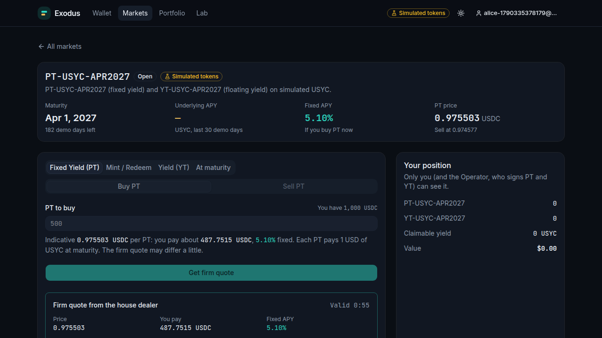
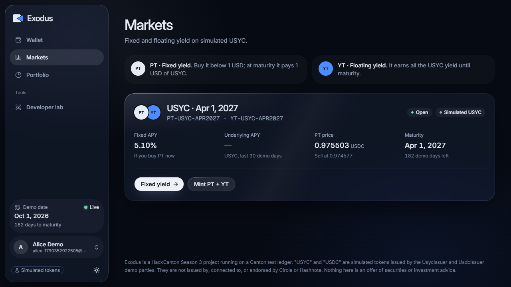
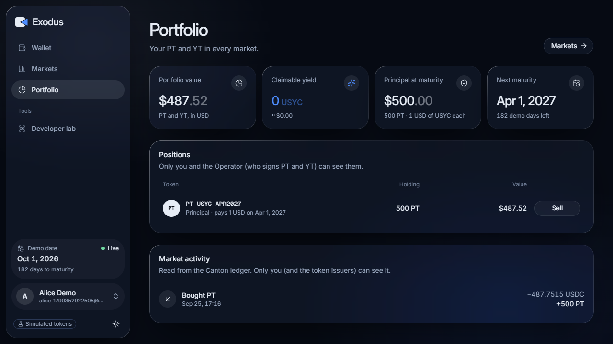
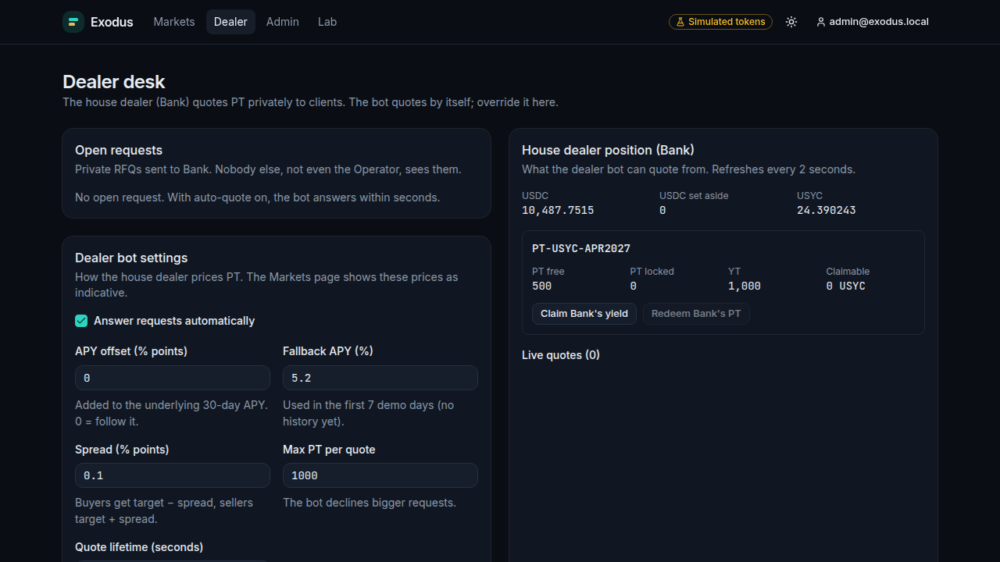
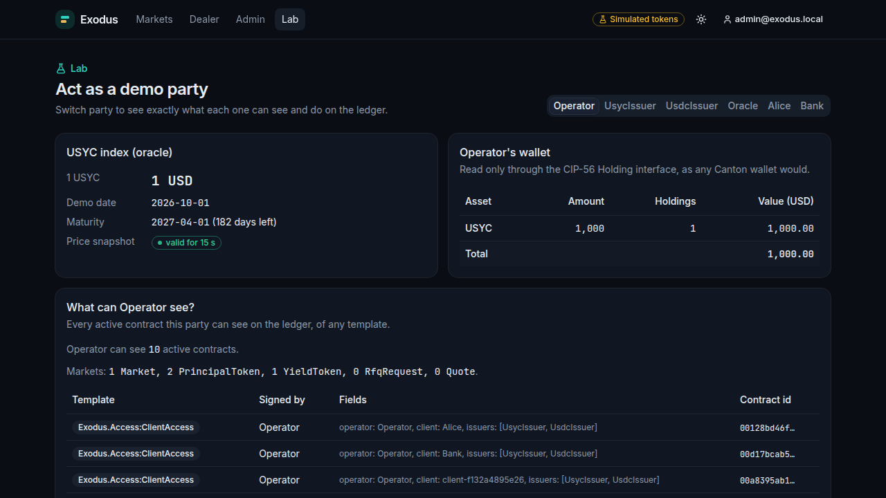
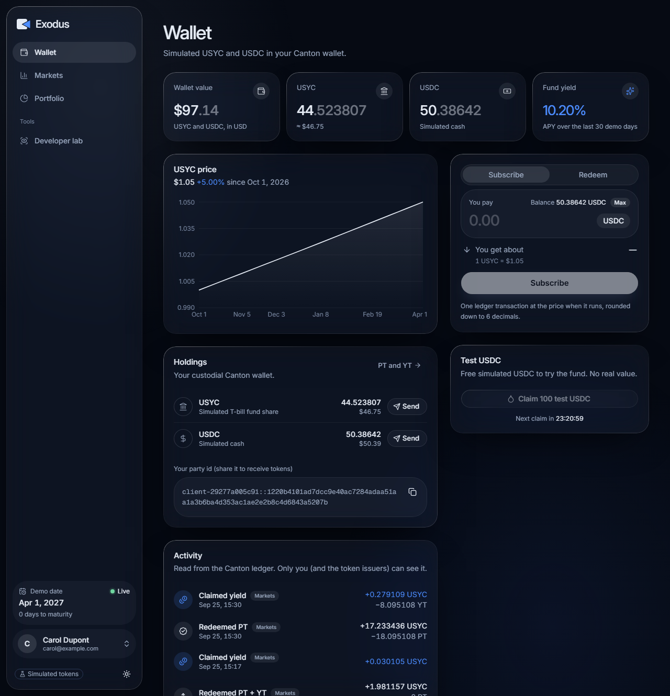

# Exodus

**Private fixed-rate yield markets on Canton.** Built for HackCanton Season 3.

Exodus takes a yield-bearing asset, a simulated **USYC** (a tokenized money market fund of short-term US T-bills, live on Canton), and splits it into:

- **PT (Principal Token)**: worth 1 USD of USYC at maturity. Buy it below 1.00 to lock in a **fixed rate**.
- **YT (Yield Token)**: collects all the fund's yield until maturity: the **floating rate**.

PTs trade through **private RFQ** with **atomic delivery versus payment**: only the buyer and the dealer ever see the price. The idea comes from Pendle, redesigned for Canton's privacy and permissioned markets (no AMM).

> **Simulation notice.** "USYC" and "USDC" in Exodus are **simulated** tokens issued by our own demo parties (`UsycIssuer`, `UsdcIssuer`). They behave like the real ones but are **not** issued by, connected to, or endorsed by Circle or Hashnote.



## What works today

| Part | Status |
|---|---|
| **Daml contracts** (`exodus-contract/`) | USYC/USDC holdings with the Canton Token Standard (CIP-56), the oracle price feed, the USYC fund (subscribe and redeem), `ClientAccess` passes, and the markets: **split** USYC into PT + YT, **private RFQ** with firm locked quotes and **atomic DvP**, YT **claims**, Pendle-style **maturity**, PT **redeem** and **merge**. **55 Daml Script tests**, including the full worked example (`DemoTest`). |
| **Markets app** (`exodus-app/web` + `exodus-app/api`) | Markets list, a market page (*Fixed Yield (PT)* with a firm quote in about 2 seconds, *Mint / Redeem*, *Yield (YT)*, *At maturity*), a portfolio with Pendle-style USD value, and a dealer desk for admins. An **Operator bot** matures markets and pays every payout; a **house dealer bot** quotes with Pendle's formula. |
| **Wallet** (the simulated USYC on-ramp) | Sign up → access form → admin approval (custodial Canton party + access pass) → faucet, subscribe USDC → USYC, redeem, send, activity read from the ledger, price chart. |
| **Developer lab** (`/lab`) | Act as any demo party, move the demo clock, and see which contracts each party can see: the Operator sees **0 quotes**. |
| **Demo** | `docker compose up` runs everything; a 3-minute [demo script](docs/demo/script.md); `npm run demo:markets` replays the worked example through the ledger client (47 checks). |

| Markets | Portfolio |
|---|---|
|  |  |
| **Dealer desk (admins)** | **Privacy (/lab as the Operator)** |
|  |  |

The **Wallet**, the simulated USYC on-ramp (faucet, subscribe, redeem, send):



## Why Canton

- **Privacy by design:** a contract is only sent to its stakeholders. Clients never see each other's balances, passes or trades, and the operator never sees an RFQ price.
- **Atomic settlement:** paying USDC and receiving USYC happen in one transaction, or not at all.
- **Permissioned assets:** real USYC is permissioned. Here, every subscribe and transfer checks an on-ledger access pass for both sides.

## Run it

**With Docker (one command).** From the repository root:

```bash
docker compose up --build     # first build: 10-20 min (downloads the Daml SDK)
```

Open **http://localhost:8080**. Admin login: `admin@exodus.local` / `exodus-demo-admin` (demo only). The demo clock stays on Oct 1 2026 until you move it on `/lab` as the Oracle. `docker compose down` then `up` gives a fresh demo. The [demo script](docs/demo/script.md) walks through the 3-minute story.

**On a public server** (HTTPS with nginx on port 8443): follow **[docs/deploy.md](docs/deploy.md)**.

**By hand (for development):** follow **[docs/run-locally.md](docs/run-locally.md)**. Short version, from `exodus-app/`:

```bash
npm run codegen:daml && npm install
cp api/.env.example api/.env        # set ADMIN_PASSWORD
npm run db:up && npm run db:migrate && npm run db:seed

npm run ledger                        # terminal 1
npm run bootstrap && npm run oracle   # terminal 2
npm run api                           # terminal 3
npm run web                           # terminal 4 -> http://localhost:5173
```

## Repository map

| Path | What is inside |
|---|---|
| [`docs/exodus.md`](docs/exodus.md) | The design spec: parties, contracts, flows, the maths with a worked example, the privacy model, known gaps |
| [`docs/client-app.md`](docs/client-app.md) | The client app's decisions, pages, API endpoints and build log |
| [`docs/run-locally.md`](docs/run-locally.md) | How to run everything on your machine |
| [`docs/deploy.md`](docs/deploy.md) | How to put the demo online with `docker-compose.prod.yml` (nginx, HTTPS, certbot) |
| [`docs/markets-plan.md`](docs/markets-plan.md) | The markets (Pendle part) tracker: every decision, the phases and the session log |
| [`docs/demo/`](docs/demo/) | The 3-minute demo script and the screen recorder (`record-demo.mjs`) |
| `docker-compose.yml`, `docker/` | The one-command demo: sandbox, PostgreSQL, bootstrap, oracle, API, web |
| `docker-compose.prod.yml`, `.env.prod.example` | The same demo online, behind nginx with HTTPS |
| `exodus-contract/` | Daml smart contracts (`main`) and Daml Script tests (`test`), SDK 3.5.11 |
| `exodus-app/ledger` | Typed client for the Canton JSON Ledger API v2, shared by everything below |
| `exodus-app/api` | NestJS + Prisma + PostgreSQL backend: accounts, approvals, custodial wallets, faucet, price history, markets, the Operator and house dealer bots |
| `exodus-app/web` | React + Vite + Tailwind + shadcn/ui web app |
| `exodus-app/oracle-bot` | Publishes the simulated USYC price and moves the demo clock |

## Checks

Run each line from the repository root:

```bash
(cd exodus-contract && dpm build --all && cd test && dpm test)        # Daml contracts: 55 tests
(cd exodus-app && npm test)                                           # off-ledger unit tests: 99 tests
(cd exodus-app && npm run typecheck && npm run lint -w @exodus/web)   # types and lint
```
