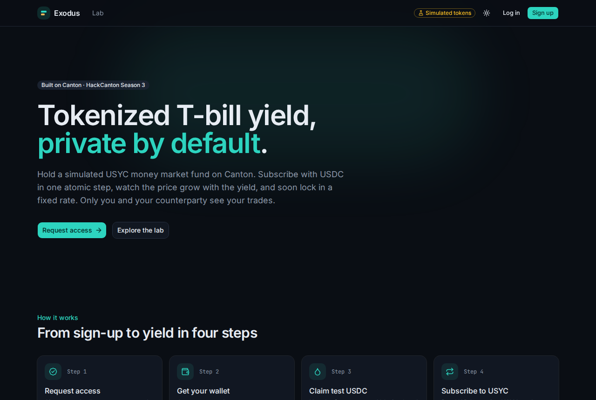
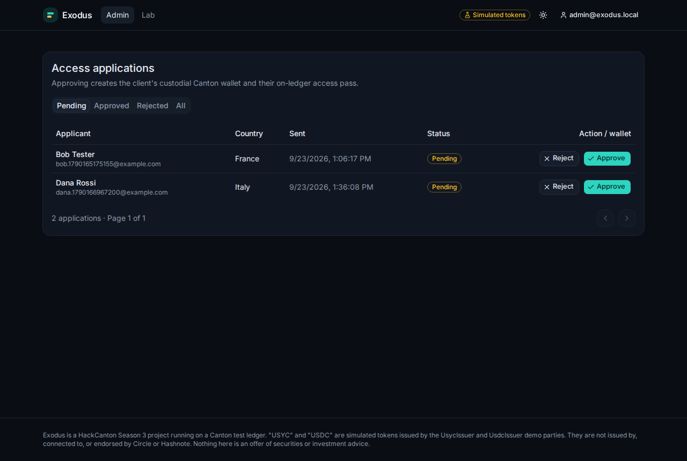

# Exodus

**Private fixed-rate yield markets on Canton.** Built for HackCanton Season 3.

Exodus takes a yield-bearing asset, a simulated **USYC** (a tokenized money market fund of short-term US T-bills, live on Canton), and splits it into:

- **PT (Principal Token)**: worth 1 USD of USYC at maturity. Buy it below 1.00 to lock in a **fixed rate**.
- **YT (Yield Token)**: collects all the fund's yield until maturity: the **floating rate**.

PTs trade through **private RFQ** with **atomic delivery versus payment**: only the buyer and the dealer ever see the price. The idea comes from Pendle, redesigned for Canton's privacy and permissioned markets (no AMM).

> **Simulation notice.** "USYC" and "USDC" in Exodus are **simulated** tokens issued by our own demo parties (`UsycIssuer`, `UsdcIssuer`). They behave like the real ones but are **not** issued by, connected to, or endorsed by Circle or Hashnote.


## What works today

| Part | Status |
|---|---|
| **Daml contracts** (`exodus-contract/`) | USYC/USDC holdings with the Canton Token Standard (CIP-56) `Holding` and `TransferFactory`, the oracle price feed with short-lived price snapshots, the USYC fund (subscribe USDC → USYC in one atomic step), and `ClientAccess` passes (the on-ledger client whitelist). 24 Daml Script tests. |
| **Client app** (`exodus-app/web` + `exodus-app/api`) | Sign up → access form → admin approval (creates your custodial Canton party, ledger user and access pass) → dashboard: faucet, subscribe, holdings, send to other approved clients, activity read from the ledger, and a live price chart. |
| **Developer lab** (`/lab`) | Act as any demo party, move the demo clock, and see exactly which contracts each party can see (the privacy demo). |
| **Next** | PT/YT tokens, the market (split, claim, redeem, merge) and private RFQ trading. |

| Landing page | Admin review queue |
|---|---|
|  |  |

## Why Canton

- **Privacy by design:** a contract is only sent to its stakeholders. Clients never see each other's balances, passes or trades, and the operator never sees an RFQ price.
- **Atomic settlement:** paying USDC and receiving USYC happen in one transaction, or not at all.
- **Permissioned assets:** real USYC is permissioned. Here, every subscribe and transfer checks an on-ledger access pass for both sides.

## Run it

Follow **[docs/run-locally.md](docs/run-locally.md)**: tools to install, one-time setup, the four terminals to start, a 5-minute demo and troubleshooting.

Short version, from `exodus-app/`:

```bash
npm run codegen:daml && npm install
cp api/.env.example api/.env        # set ADMIN_PASSWORD
npm run db:up && npm run db:migrate && npm run db:seed

npm run ledger                        # terminal 1
npm run bootstrap && npm run oracle   # terminal 2
npm run api                           # terminal 3
npm run web                           # terminal 4 -> http://localhost:5173
```

## Repository map

| Path | What is inside |
|---|---|
| [`docs/exodus.md`](docs/exodus.md) | The design spec: parties, contracts, flows, the maths with a worked example, the privacy model, known gaps |
| [`docs/client-app.md`](docs/client-app.md) | The client app's decisions, pages, API endpoints and build log |
| [`docs/run-locally.md`](docs/run-locally.md) | How to run everything on your machine |
| `exodus-contract/` | Daml smart contracts (`main`) and Daml Script tests (`test`), SDK 3.5.11 |
| `exodus-app/ledger` | Typed client for the Canton JSON Ledger API v2, shared by everything below |
| `exodus-app/api` | NestJS + Prisma + PostgreSQL backend: accounts, approvals, custodial wallets, faucet, price history |
| `exodus-app/web` | React + Vite + Tailwind + shadcn/ui web app |
| `exodus-app/oracle-bot` | Publishes the simulated USYC price and moves the demo clock |

## Checks

Run each line from the repository root:

```bash
(cd exodus-contract && dpm build --all && cd test && dpm test)        # Daml contracts: 24 tests
(cd exodus-app && npm test)                                           # off-ledger unit tests: 43 tests
(cd exodus-app && npm run typecheck && npm run lint -w @exodus/web)   # types and lint
```
