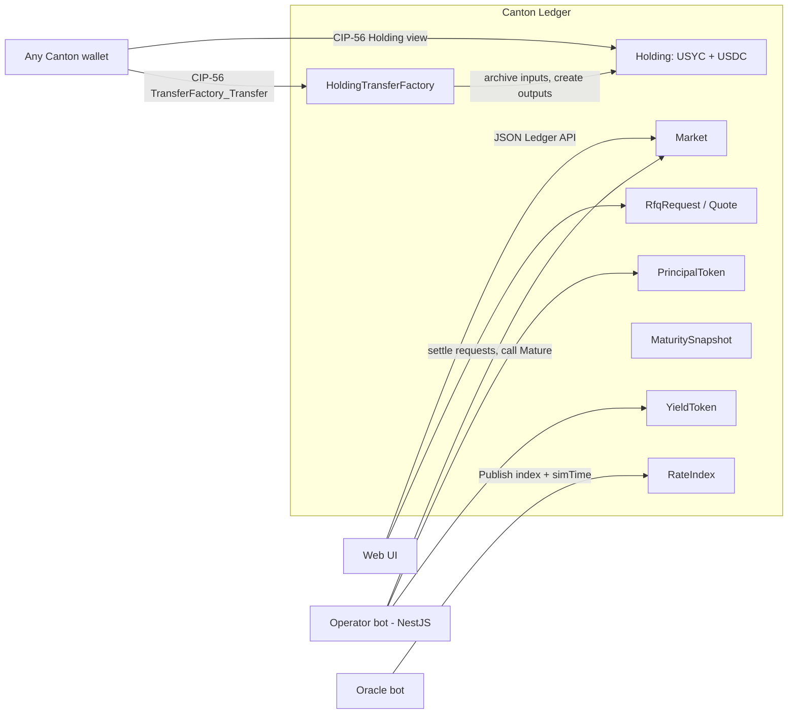
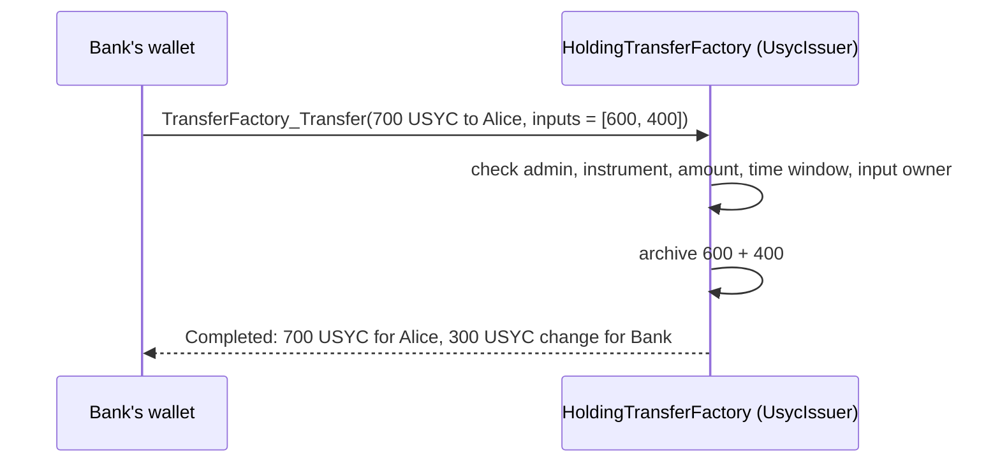
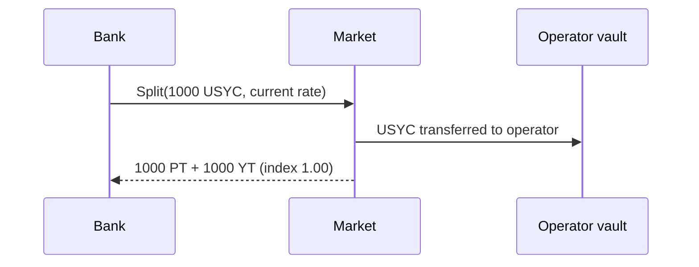
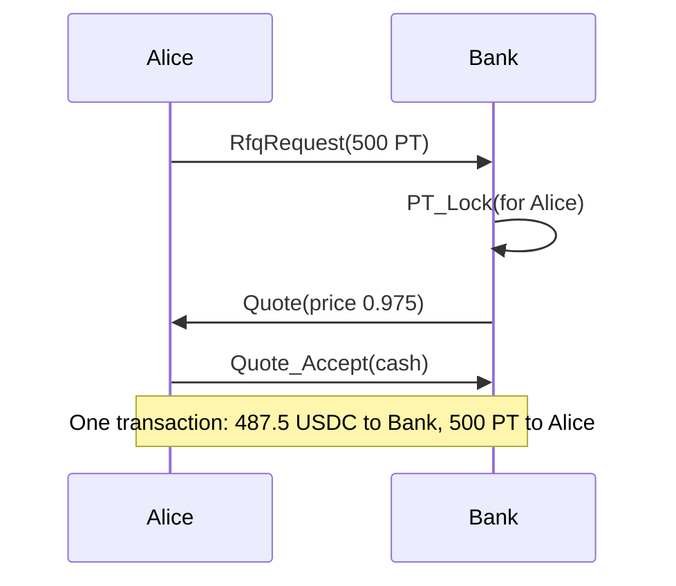

# Exodus

**Private fixed-rate yield markets on Canton.**

Exodus splits a yield-bearing asset, **USYC** (a tokenized money market fund of short-term US T-bills), into two tokens:

- **PT (Principal Token)**: pays 1 USD worth of USYC at maturity. You buy it below 1.00 to lock a **fixed rate**.
- **YT (Yield Token)**: receives all the yield of the asset until maturity. It is a bet on the **floating rate**.

PTs trade through **private RFQ** (request for quote) with **atomic DvP** (delivery versus payment). Only the buyer and the dealer see the price.

Exodus is inspired by Pendle Finance, but it is redesigned for Canton and institutional users. It is built for **HackCanton Season 3**.

> **Simulation notice.** In this project, "USYC" and "USDC" are **simulated** tokens issued by our own demo parties (`UsycIssuer`, `UsdcIssuer`). They copy how the real USYC and USDC behave. They are **not** issued by, connected to, or endorsed by Circle or Hashnote.

---

## Table of contents

1. [The problem](#1-the-problem)
2. [The solution](#2-the-solution)
3. [Why Canton](#3-why-canton)
4. [Core concepts](#4-core-concepts)
5. [Parties](#5-parties)
6. [Architecture](#6-architecture)
7. [Smart contracts](#7-smart-contracts)
8. [User flows](#8-user-flows)
9. [The math, with a full example](#9-the-math-with-a-full-example)
10. [Privacy model](#10-privacy-model)
11. [Design decisions](#11-design-decisions)
12. [Trust assumptions and known gaps](#12-trust-assumptions-and-known-gaps)
13. [Hackathon plan](#13-hackathon-plan)
14. [Pitch outline](#14-pitch-outline)
15. [Tech stack and versions](#15-tech-stack-and-versions)
16. [Glossary](#16-glossary)
17. [References](#17-references)

---

## 1. The problem

Institutions hold a lot of yield-bearing assets on Canton: tokenized Treasuries, money market funds, and repo. The yield on these assets **floats**. It goes up and down with interest rates.

Different players want different things:

| Player | What they want |
|---|---|
| Treasury desk, corporate cash manager | A **fixed** and known return. No surprises. |
| Hedge fund, trading desk | **Exposure to rates**. They want to bet that yields go up. |
| Dealer, market maker | Earn a spread by matching the two sides. |

In traditional finance this is done with zero-coupon bonds, interest rate swaps, and strips. It is slow, bilateral, and needs a lot of manual reconciliation.

On public DeFi (Pendle on Ethereum), it is fast, but **every trade is public**: price, size, and wallet. Institutions cannot show their positions and prices to the whole market.

## 2. The solution

Exodus gives institutions a fixed-rate product with three properties:

1. **Split**: deposit a yield asset and get PT + YT for a chosen maturity date.
2. **Private trading**: a buyer asks one dealer for a PT price. Only those two parties see the quote.
3. **Atomic settlement**: cash and PT move in one transaction, or nothing moves.

At maturity:

- PT holders redeem 1 USD of the asset per PT.
- YT holders have already collected all the yield up to maturity.

## 3. Why Canton

Judges in HackCanton Season 2 asked a key question: **would this product lose anything if you removed the blockchain?** The strongest projects had Canton doing real architectural work, not a Daml contract hidden in the backend.

Exodus answers this question with four points:

| Canton feature | How Exodus uses it | What you lose without it |
|---|---|---|
| Sub-transaction privacy | Operator sees PT move but not the price. Cash issuer sees cash move but not the PT. | Price and position leakage (Pendle on Ethereum) |
| Atomic multi-party transactions | Cash leg and PT leg settle in one transaction | Settlement risk, manual reconciliation |
| Permissioned parties | Only KYC'd `members` can use a market | Compliance problems |
| Real institutional yield assets on the network | PT/YT built on a model of USYC, a real tokenized money market fund that is live on Canton | Fake demo yield with no market fit |
| Canton Token Standard (CIP-56) | Our USYC and USDC implement the standard `Holding` and `TransferFactory` interfaces, so any Canton wallet can show and send them | A closed token that only our own UI understands |

**Why not an AMM like Pendle?** Two reasons:

1. **Contention**: Daml uses a UTXO model. Every change archives a contract and creates a new one. If every trade touches one pool contract, two users trading at the same time will conflict.
2. **Privacy**: a public pool shows every trade to everyone. RFQ keeps trades bilateral.

## 4. Core concepts

### The yield asset (USYC) and the index

The asset is a simulated **USYC** token. The real USYC is the on-chain share of a money market fund that invests in short-term US T-bills and repo. It is issued by Hashnote (owned by Circle) and is live on Canton.

USYC is **price-accreting**: the **number** of tokens you hold never changes, but the **price** of one token goes up as the fund earns interest. Exodus models that price as an **index** that only goes up:

- Index 1.00 means 1 USYC = 1.00 USD.
- Index 1.025 means 1 USYC = 1.025 USD (the fund earned 2.5%).

Example: Bank holds 1000 USYC in October and still holds exactly 1000 USYC in April. At index 1.05 those 1000 USYC are worth 1050 USD. The yield is in the price, not in the token count.

An **oracle** publishes the index (the real USYC also publishes its price through an oracle feed). It also publishes a **demo clock** (`simTime`) so the demo can show 6 months in 3 minutes.

Payments use simulated **USDC** (a stablecoin, 1 USDC = 1 USD).

| Real USYC | Exodus simulation |
|---|---|
| Issued by Hashnote/Circle | Issued by our `UsycIssuer` demo party |
| Token count fixed, price rises daily | `Holding.amount` fixed, oracle index rises |
| Price streamed by an oracle | `RateIndex` published by the `Oracle` party |
| Bought and redeemed with USDC | USDC is another `Holding` (`instrument = "USDC"`) |
| Only KYC'd, non-US qualified investors | Not modelled (see known gaps) |
| Implements the Canton Token Standard | Implements `Holding` + `TransferFactory` (v1) |

### PT (Principal Token)

- 1 PT = 1 USD of the asset at maturity.
- Before maturity it trades **below 1.00**. The discount is the fixed return.
- It works like a zero-coupon bond.

### YT (Yield Token)

- 1 YT = the yield of 1 USD of the asset until maturity.
- The holder can claim yield at any time.
- After maturity, YT is worth nothing more.

### Market

A market is one asset plus one maturity date. Example: `PT-USYC-APR2027`.

## 5. Parties

| Party | Role |
|---|---|
| **Operator** | Runs the markets and the vault. Settles redeem, claim, and merge requests. Runs as an automation bot. |
| **UsycIssuer** | Issues the simulated USYC fund tokens. Admin of the USYC instrument and its transfer factory. Runs the `UsycFund`: receives USDC and mints USYC to subscribers. |
| **UsdcIssuer** | Issues the simulated USDC cash. Admin of the USDC instrument and its transfer factory. |
| **Oracle** | Publishes the index and the demo clock. |
| **Alice** (demo) | Wants a fixed rate. Buys PT. |
| **Bank** (demo) | Dealer. Splits USYC, sells PT, keeps YT. |

## 6. Architecture



Off-ledger components (in `exodus-app/`, see its README):

- **Operator bot (NestJS)** (planned): watches `RedeemRequest`, `ClaimRequest`, and `MergeRequest`, then settles them. Merges vault pieces. Calls `Mature` once per market.
- **Oracle bot** (done, plain Node script for now): moves the index and the demo clock along the section 9 path (1.00 on Oct 1, 1.025 on Jan 1, 1.05 on Apr 1).
- **Web UI** (walking skeleton done): today it shows the index, the demo clock, CIP-56 balances with USD value, a CIP-56 send form and a per-party "what can I see?" privacy table. Later: PT price, implied fixed APY, YT yield, and a maturity countdown.

## 7. Smart contracts

The Daml code lives in `exodus-contract/`, a multi-package project. Contract code goes in the `main` package and Daml Script tests go in the `test` package. Modules use the `Exodus.` prefix.

```
exodus-contract/
  multi-package.yaml
  dars/splice/                    # Canton Token Standard v1 DARs (see its README)
  main/                           # package exodus-contract-main
    daml.yaml
    daml/Exodus/
      Holding.daml                # USYC + USDC holdings, roundDown6, payFrom, CIP-56 view  [done]
      TransferFactory.daml        # CIP-56 TransferFactory for our holdings                [done]
      Oracle.daml                 # RateIndex (index + demo clock)                          [done]
      Fund.daml                   # UsycFund: Subscribe (pay USDC, get USYC atomically)     [done]
      Tokens.daml                 # MarketTerms, PT, YT, MaturitySnapshot, Redeem/Claim     [to do]
      Market.daml                 # Market (Split, Mature, RequestMerge), MergeRequest      [to do]
      Rfq.daml                    # RfqRequest, Quote (private DvP, pays with payFrom)       [to do]
  test/                           # package exodus-contract-test
    daml.yaml
    daml/Exodus/
      HoldingTest.daml            # lifecycle, failures, privacy, roundDown6               [done]
      TokenStandardTest.daml      # wallet view + TransferFactory transfers                [done]
      OracleTest.daml             # publish, failures, privacy                              [done]
      FundTest.daml               # subscribe, stale index, fake oracle/USDC, privacy       [done]
      DemoTest.daml               # the worked example in section 9                         [to do]
```

### Templates

| Template | Signatories | Observers | Purpose |
|---|---|---|---|
| `Holding` | issuer | owner | Simulated USYC or USDC. Choices: `Transfer`, `SplitOff`, `MergeWith`. Implements CIP-56 `Holding`. |
| `HoldingTransferFactory` | admin (issuer) | users | One per issuer. Implements CIP-56 `TransferFactory` (`TransferFactory_Transfer`, `TransferFactory_PublicFetch`). |
| `UsycFund` | usycIssuer | users | Nonconsuming `Subscribe`: the subscriber pays USDC (via `payFrom`) to UsycIssuer and gets `roundDown6 (usdc / index)` USYC in the same transaction. Checks the `RateIndex` comes from its trusted `oracle` and the USDC from its `usdcIssuer`. Users must also be `RateIndex` readers. |
| `RateIndex` | oracle | operator, readers | Index + demo clock. Choice: `Publish` (index and time can only go up). |
| `Market` | operator | members | Choices: `Split`, `Mature`, `RequestMerge`. All nonconsuming. |
| `MaturitySnapshot` | operator | members | Frozen index at maturity. |
| `PrincipalToken` | operator | owner, lockedFor | Choices: `PT_Transfer`, `PT_SplitOff`, `PT_Lock`, `PT_Unlock`, `PT_DeliverLocked`, `PT_RequestRedeem`. |
| `YieldToken` | operator | owner | Choices: `YT_Transfer`, `YT_SplitOff`, `YT_RequestClaim`. |
| `RedeemRequest` | operator, owner | | `Redeem_Settle` (operator), `Redeem_Cancel` (owner). |
| `ClaimRequest` | operator, owner | | `Claim_Settle` (operator), `Claim_Cancel` (owner). |
| `MergeRequest` | operator, owner | | `Merge_Settle` (operator), `Merge_Cancel` (owner). |
| `RfqRequest` | buyer | dealer | `Rfq_Quote` (dealer), `Rfq_Cancel` (buyer). |
| `Quote` | buyer, dealer | | `Quote_Accept` (buyer, atomic DvP), `Quote_Reject`, `Quote_Withdraw`. |

### Canton Token Standard (CIP-56)

Our holdings plug into the official Canton Token Standard, **v1**. The standard is a set of Daml **interfaces**. Any template that implements them can be read and moved by any Canton wallet, with no Exodus-specific code in the wallet.

| Standard interface | Implemented by | What a wallet can do |
|---|---|---|
| `Splice.Api.Token.HoldingV1:Holding` | `Holding` | List balances. Our holding is shown as `owner`, `instrumentId = {admin = issuer, id = instrument}`, `amount`, `lock = None`. |
| `Splice.Api.Token.TransferInstructionV1:TransferFactory` | `HoldingTransferFactory` | Send tokens with `TransferFactory_Transfer`. |

**How a wallet transfer works.** Bank holds 600 USYC and 400 USYC and sends 700 USYC to Alice:



- The transfer finishes in **one step** (`TransferInstructionResult_Completed`). Alice does not need to accept, same as our own `Transfer` choice. So we don't need a `TransferInstruction` template.
- The wallet must list the input holdings. We don't pick them automatically.
- Exodus's own workflows (Split, RFQ, vault payouts) keep using the simpler `Holding` choices. The factory is for wallets.
- The DARs are pinned at `1.0.0` in `exodus-contract/dars/splice/` (taken from the Splice v0.8.3 release bundle).

### Shared data types

- `MarketTerms`: marketId, assetIssuer, instrument, oracle, maturity. Copied into every PT and YT.
- `IndexSource`: `CurrentRate` (live oracle, before maturity) or `AtMaturity` (frozen snapshot, after maturity).

## 8. User flows

### 8.0 Subscribe (get USYC with USDC)

Like the real USYC, anyone on the fund's user list can buy USYC with USDC. It is one atomic transaction, like `deposit()` on an EVM vault:

1. Alice calls `Subscribe` on the `UsycFund` with 500 USDC and the current `RateIndex` (index 1.025).
2. `payFrom` merges her USDC holdings, splits off 500 and transfers it to UsycIssuer. She keeps the change.
3. UsycIssuer's signature on the fund lets the choice mint `roundDown6 (500 / 1.025)` = **487.804878 USYC** for Alice.

If any check fails (a fake oracle, fake USDC, not enough USDC, a stale `rateCid`), nothing moves. The client reads the `RateIndex` last, right before submitting, and retries once on a stale-contract error (gap 12). Redemption (USYC back to USDC) is not built yet (gap 13).

### 8.1 Split



Rules: user must be a member, the holding must be USYC from the market's issuer, and the market must not be matured.

### 8.2 Private PT sale (RFQ + DvP)



The PT is **locked for Alice** during the quote for two reasons: Alice must be able to see it to settle, and Bank must not sell it twice.

### 8.3 Claim yield (YT)

1. YT holder calls `YT_RequestClaim`. This creates a `ClaimRequest`.
2. The operator bot calls `Claim_Settle` with a vault piece and an index source.
3. The holder receives USYC, and the YT is recreated with the new `lastIndex`.

### 8.4 Maturity

1. The oracle clock reaches the maturity date.
2. The operator calls `Mature`, which creates a `MaturitySnapshot` with the frozen index.
3. After this point, `Split` fails, and yield claims must use the snapshot.

### 8.5 Redeem PT

1. PT holder calls `PT_RequestRedeem`.
2. The operator calls `Redeem_Settle` with the snapshot.
3. The holder receives `ptAmount / maturityIndex` USYC.

### 8.6 Merge (PT + YT back to USYC)

1. User calls `RequestMerge` with a PT and a YT of the same size.
2. The operator calls `Merge_Settle`.
3. The user receives `amount / yt.lastIndex` USYC. This works at any time.

## 9. The math, with a full example

### Formulas

| Action | Formula | Unit |
|---|---|---|
| Split | PT = YT = `usycAmount * index` | USD notional |
| YT yield | `notional * (1/lastIndex - 1/newIndex)` | USYC |
| PT redeem | `ptAmount / maturityIndex` | USYC |
| Merge | `amount / yt.lastIndex` | USYC |
| Fixed APY for a PT buyer | `(1/price)^(1/years) - 1` | percent |

**Why merge = `amount / lastIndex`:**
principal part `amount / nowIndex` + unclaimed yield `amount * (1/lastIndex - 1/nowIndex)` = `amount / lastIndex`.

All payouts **round down to 6 decimals**, so the vault never pays out more than it holds.

### Full example (this is exactly what `DemoTest.daml` will check)

Start: Oct 1 2026. Maturity: Apr 1 2027 (0.5 years).

**Step 1. Bank splits 1000 USYC at index 1.00**
- PT = YT = 1000 * 1.00 = **1000**
- Vault holds 1000 USYC.

**Step 2. Alice buys 500 PT at 0.975**
- Alice pays 500 * 0.975 = **487.5 USDC**
- Return over 6 months: 500 / 487.5 = 1.025641, so +2.5641%
- Fixed APY: 1.025641^2 - 1 = 1.051940 - 1 = **about 5.19%**

**Step 3. Jan 1 2027, index = 1.025. Bank claims yield on 1000 YT**
- 1000 * (1/1.00 - 1/1.025) = 1000 * 0.0243902439 = **24.390243 USYC**
- Value check: 24.390243 * 1.025 = 25.0 USD (2.5% of 1000)

**Step 4. Apr 1 2027, index = 1.05. Operator calls `Mature`**
- Snapshot index = 1.05. New splits now fail.

**Step 5. Alice redeems 500 PT**
- 500 / 1.05 = **476.190476 USYC** (worth 476.190476 * 1.05 = 499.9999998 USD)

**Step 6. Bank claims the last yield and redeems its own 500 PT**
- Yield: 1000 * (1/1.025 - 1/1.05) = 1000 * (0.9756097561 - 0.9523809524) = **23.228803 USYC**
- Redeem: 500 / 1.05 = **476.190476 USYC**

**Step 7. Vault check**
- Paid out: 24.390243 + 476.190476 + 23.228803 + 476.190476 = 999.999998
- Left in vault: 1000 - 999.999998 = **0.000002 USYC** (rounding dust, never negative)

**Who earned what (values at index 1.05)**

| Party | Start | End | Profit |
|---|---|---|---|
| Alice | 487.5 USDC | 500.0 USD of USYC | **+12.5 USD** (fixed) |
| Bank | 1000 USYC = 1000 USD | 523.809522 USYC (550.0 USD) + 487.5 USDC = 1037.5 USD | **+37.5 USD** (floating) |
| Total | | | **50 USD = 1000 * (1.05 - 1.00)** |

The total profit equals the total yield of the fund. Nothing is created or lost. The split only moves risk between Alice and Bank.

## 10. Privacy model

In one `Quote_Accept` transaction, each party sees only its own part:

| Party | Sees the quote price? | Sees the cash leg? | Sees the PT leg? |
|---|---|---|---|
| Alice (buyer) | Yes | Yes | Yes |
| Bank (dealer) | Yes | Yes | Yes |
| Operator | **No** | **No** | Yes (it signs PTs) |
| UsdcIssuer | **No** | Yes | **No** |
| Other members | No | No | No |

The test script checks that `Operator` and `UsdcIssuer` see **zero** `Quote` contracts.

## 11. Design decisions

| Decision | Why |
|---|---|
| RFQ instead of AMM | Avoids contention on one pool contract, keeps prices private, and matches how institutions trade. |
| Market choices are nonconsuming | The Market contract is never archived, so many users can split at the same time. |
| `MarketTerms` copied into PT/YT | Daml 3.x does not support contract keys, so tokens cannot look up the market by key. |
| Request, then operator settles | Users cannot see vault holdings, so only the operator can pick which vault piece pays. The bot settles one by one, so there is no contention. |
| Every request has a Cancel choice | If the operator does nothing, the user gets the tokens back. |
| Holdings signed only by the issuer | Transfers are one step with no "accept" needed. This is simple for a demo. |
| Simulate USYC instead of a made-up fund | USYC is a real, price-accreting tokenized T-bill fund that is live on Canton, so the demo tells a real institutional story. |
| Implement CIP-56 v1 (not v2) | v1 is the version wallets and Canton Coin support today. v2 (accounts) is newer. |
| Token standard DARs checked into `dars/splice/` | `dpm add dar` only installs from an OCI registry, and these DARs are only shipped in the Splice release bundle. |
| One-step `TransferFactory` (no `TransferInstruction`) | Matches our one-step `Transfer`. The standard allows returning `Completed` directly. |
| Demo clock `simTime` | Ledger time cannot be moved forward on a real network, and the demo must show months of yield in minutes. |
| Round down payouts to 6 decimals | Makes it impossible for the vault to go negative. |
| PT price must be > 0 and <= 1 | With positive rates, PT always sells below par. |

## 12. Trust assumptions and known gaps

Say these openly in the pitch. Judges respect honesty more than hidden problems.

### Trust assumptions

- **Operator is trusted**: it settles requests and could delay them. Users can cancel.
- **Oracle is trusted**: for the index and the demo clock.
- **Issuers are trusted**: they sign holdings. `UsycIssuer` and `UsdcIssuer` stand in for Circle.

### Known gaps (to fix)

| # | Gap | Risk | Planned fix |
|---|---|---|---|
| 1 | `Mature` can be called twice | Two snapshots with different indexes | Make `Mature` consuming: archive the Market and recreate it with `matured = True` |
| 2 | Late oracle at maturity | Snapshot includes extra yield, so PT holders get less | Require `simTime == maturity` in `Mature` |
| 3 | No automatic maturity | Someone must call `Mature` | Operator bot calls it |
| 4 | `PT_RequestRedeem` allowed before maturity | Request waits forever (bad UX, no loss) | Add a date check |
| 5 | Post-maturity yield stays in vault | Funds are stuck | Add a treasury sweep choice |
| 6 | Maturity uses `simTime`, not ledger time | Only OK for a demo | Check ledger time in production |
| 7 | Only USYC/USDC implement the token standard (`Holding` + `TransferFactory` v1). PT and YT don't yet. | Canton wallets cannot show PT/YT | Add a `Holding` interface instance to `PrincipalToken` and `YieldToken` (use `lock` for locked PT) |
| 8 | No quote expiry | Old quotes stay open | Add `validUntil` |
| 9 | Transfer factory is shared with an observer list (`users`) | New users need the factory recreated | Serve it through the off-ledger registry API with explicit disclosure, like real registries do |
| 10 | No off-ledger registry API (`/registry/transfer-instruction/v1/...`, `/registry/metadata/v1/...`) | Real wallets cannot discover the factory or instrument metadata by themselves | Serve these endpoints from the NestJS backend |
| 11 | No KYC allowlist (real USYC is permissioned) | Anyone can receive simulated USYC | Issuer-managed allowlist checked on transfer |
| 12 | Stale `rateCid`: every `Publish` archives the `RateIndex`, so a command holding the old id fails (`CONTRACT_NOT_FOUND`, or `LOCAL_VERDICT_LOCKED_CONTRACTS` when two commands race). Found by the walking skeleton: the UI lost 6 of 6 races against a bot publishing every 0.3 s. | `Split` and `Claim` fail whenever the oracle publishes between the user's read and submit | First fix, used by `Subscribe`: the client reads the `RateIndex` last and retries once on a stale error (`exodus-app/ledger/src/subscribe.ts`). With the bot publishing every 1 s, 10 of 10 subscribes succeeded, all after one retry. Still to decide for `Split`: keep this, publish less often, or have the operator settle a `SplitRequest` with the fresh index |
| 13 | No USYC redemption (USYC back to USDC) | Users cannot exit USYC to cash | Request + settle (`RedeemUsycRequest`), so many redeemers do not fight over the fund's USDC holdings |

## 13. Hackathon plan

HackCanton Season 3 is a 5-week online hackathon. Two official posts give different start dates (Sep 10 and Sep 17, 2026). **Confirm the exact deadline on appsfactory.cc/hackathons.**

| Week | Goal | Status |
|---|---|---|
| 1 | Daml core: Holding (USYC/USDC) with CIP-56 `Holding` + `TransferFactory` | Done (tests pass) |
| 1-2 | Daml core: Oracle (done), Split, PT/YT, Claim, Redeem, Merge, RFQ, demo test | To do |
| 2 | Walking skeleton in `exodus-app/`: sandbox, bootstrap, oracle bot, web UI (CIP-56 wallet, send, privacy table) | Done |
| 2 | Fix known gaps 1, 2, 4, 12. Operator bot (NestJS). | To do |
| 3 | Web UI: markets, RFQ screen, yield chart, maturity countdown (on top of the skeleton) | To do |
| 4 | Deploy on LocalNet / DevNet. Record demo video. | To do |
| 5 | Pitch deck. Stretch: token standard interfaces for PT/YT, registry API. | To do |

### Demo script (3 minutes)

1. Bank splits 1000 USYC, gets 1000 PT + 1000 YT.
2. Alice sends a private RFQ. Bank quotes 0.975. Show the fixed APY of about 5.19%.
3. Switch to the Operator view: the quote price is **not visible**.
4. Alice accepts. Cash and PT swap atomically.
5. Oracle bot moves time 3 months. Bank claims 24.39 USYC of yield.
6. Oracle bot moves to maturity. Operator matures the market.
7. Alice redeems and gets 500 USD of value. Show the profit table.

## 14. Pitch outline

1. **Problem**: institutions want fixed rates on tokenized Treasuries, but public DeFi leaks every trade.
2. **Solution**: Exodus splits yield into PT (fixed) and YT (floating), traded privately.
3. **Why Canton**: privacy, atomic DvP, permissioned markets, real yield assets on the network.
4. **Demo**: the 7 steps above.
5. **Math proof**: total profit = total fund yield (the table in section 9).
6. **Honest limits**: trusted operator and oracle, and the gaps list.
7. **Next**: plug into the real USYC on Canton (it already speaks the same token standard), token standard for PT/YT, more maturities, yield curve view.

## 15. Tech stack and versions

| Part | Tech | Version notes |
|---|---|---|
| Smart contracts | Daml | **Daml SDK 3.5.11** (`dpm version --active`) |
| Build tool | `dpm` | The old `daml` assistant is deprecated in favor of `dpm` |
| Token standard | Splice CIP-56 v1 interfaces | `splice-api-token-{metadata,holding,transfer-instruction}-v1` **1.0.0**, from the Splice **v0.8.3** release bundle, in `exodus-contract/dars/splice/` |
| Network | Canton LocalNet / DevNet | DevNet was listed at Canton 3.5.1 in June 2026. Match `sdk-version` to what the hackathon uses. |
| Ledger client | JSON Ledger API v2 | `openapi-fetch` 0.17 with types from the Canton 3.5.18 OpenAPI spec (`openapi-typescript` 7.13); Daml types from `dpm codegen-js` + `@daml/types` 3.5.3. `@daml/ledger` is not used (JSON API v1 only). |
| Local ledger | `dpm sandbox` | Canton 3.5.18, JSON API on port 7575, no auth |
| Bots | Oracle bot: Node.js 24 TypeScript script. Operator bot: NestJS | Oracle bot done (`exodus-app/oracle-bot`). Operator bot planned. |
| UI | React 19.3 + Vite 8.3 + TypeScript 7.0 + TanStack Query 5 | Walking skeleton done (`exodus-app/web`) |

Check the latest versions before you start each part. They change often.

### Run the tests

```bash
cd exodus-contract
dpm build --all      # builds main, then test

cd test
dpm test             # runs every Daml Script test (HoldingTest, TokenStandardTest, ...)
```

## 16. Glossary

| Word | Meaning |
|---|---|
| **PT** | Principal Token. Pays 1 USD of the asset at maturity. |
| **YT** | Yield Token. Gets the yield until maturity. |
| **Index** | Value of 1 USYC in USD. It only goes up. |
| **USYC** | A real tokenized money market fund (short-term US T-bills) issued by Hashnote/Circle. Simulated in Exodus. |
| **USDC** | A USD stablecoin. Simulated in Exodus as the cash leg. |
| **Price-accreting** | The token count stays the same and the price goes up (USYC works this way). The opposite is rebasing, where the count goes up. |
| **CIP-56** | The Canton Network Token Standard. |
| **Interface** | A Daml "plug shape". Any template that implements it can be used by code that only knows the interface (for example a wallet). |
| **Transfer factory** | The contract a wallet calls to send tokens under CIP-56. |
| **Instrument ID** | CIP-56 name of a token: `admin` (the issuer party) plus `id` (for example "USYC"). |
| **Maturity** | The end date of a market. |
| **RFQ** | Request for quote. The buyer asks, the dealer answers with a price. |
| **DvP** | Delivery versus payment. Asset and cash move together or not at all. |
| **Atomic** | All steps succeed together, or none happen. |
| **UTXO** | A model where you hold pieces (contracts), not balances. |
| **Contention** | Two transactions try to use the same contract at the same time, so one fails. |
| **Nonconsuming choice** | A choice that does not archive the contract it runs on. |
| **Contract key** | A lookup ID for contracts. Not supported in Daml 3.x. |
| **Zero-coupon bond** | A bond with no interest payments, sold below face value. |
| **APY** | Annual percentage yield. |
| **Par** | Face value, here 1.00 USD. |

## 17. References

- HackCanton Season 3 announcement: https://forum.canton.network/t/hackcanton-season-3-build-something-real-on-canton/9065
- HackCanton S3 launch post: https://forum.canton.network/t/hackcanton-s3-launch-build-ship-win-cash-prize/9119
- HackCanton Season 2 recap (judging lessons): https://dev.to/noders/hackcanton-season-2-recap-from-75-teams-to-10k-100k-cc-in-rewards-262i
- Registration: https://appsfactory.cc/hackathons
- Contract keys in Daml 3.x: https://docs.digitalasset.com/build/3.5/reference/daml/contract-keys.html
- Daml releases: https://github.com/digital-asset/daml/releases
- Canton developer resources: https://www.canton.network/developer-resources
- Pendle Finance (inspiration): https://www.pendle.finance
- USYC (Circle): https://www.circle.com/usyc
- Circle acquires Hashnote and USYC, brings USDC to Canton: https://www.circle.com/pressroom/circle-announces-acquisition-of-hashnote-and-usyc-tokenized-money-market-fund-alongside-strategic-partnership-with-global-trading-firm-drw
- CIP-56 Canton Network Token Standard: https://github.com/global-synchronizer-foundation/cips/blob/main/cip-0056/cip-0056.md
- Token Standard APIs (Splice docs): https://docs.global.canton.network.sync.global/app_dev/token_standard/index.html
- Token standard Daml source: https://github.com/canton-network/splice/tree/main/token-standard
- Splice release bundles (DARs): https://github.com/digital-asset/decentralized-canton-sync/releases