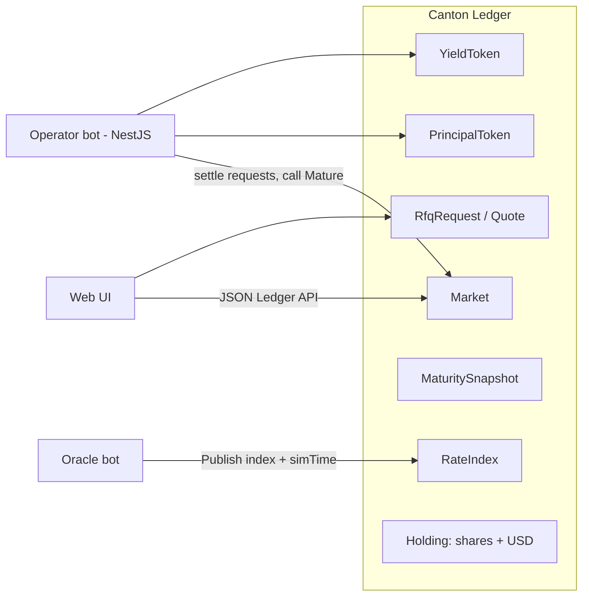
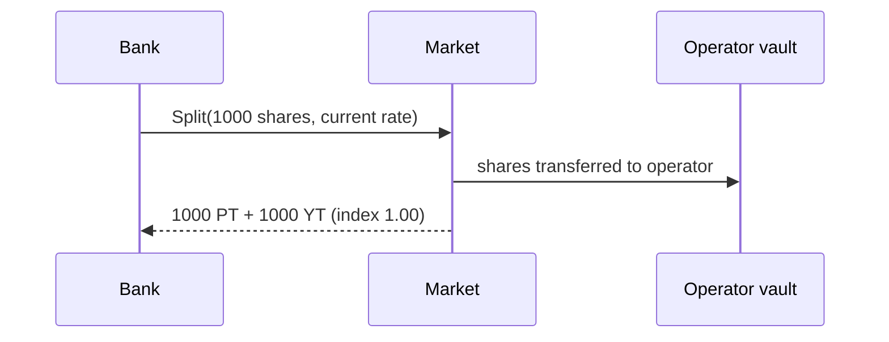
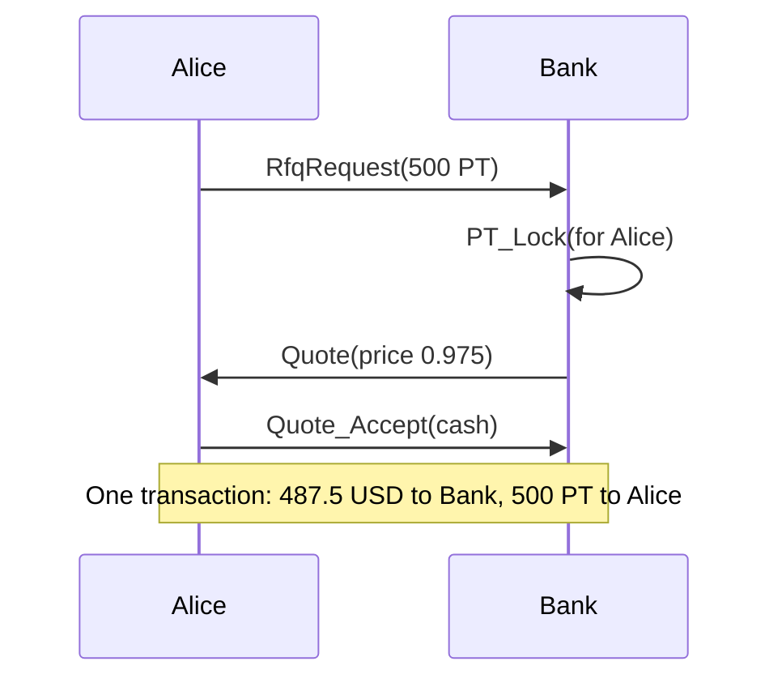

# Exodus

**Private fixed-rate yield markets on Canton.**

Exodus splits a yield-bearing asset (a tokenized T-bill fund) into two tokens:

- **PT (Principal Token)**: pays 1 USD of the asset at maturity. You buy it below 1.00 to lock a **fixed rate**.
- **YT (Yield Token)**: receives all the yield of the asset until maturity. It is a bet on the **floating rate**.

PTs trade through **private RFQ** (request for quote) with **atomic DvP** (delivery versus payment). Only the buyer and the dealer see the price.

Exodus is inspired by Pendle Finance, but it is redesigned for Canton and institutional users. It is built for **HackCanton Season 3**.

---

## Table of contents

1. [The problem](#1-the-problem)
2. [The solution](#2-the-solution)
3. [Why Canton](#3-why-canton)
4. [Core concepts](#4-core-concepts)
5. [Parties](#5-parties)
6. [Architecture](#6-architecture)
7. [Smart contracts](#7-smart-contracts)
8. [User flows](#8-user-flows)
9. [The math, with a full example](#9-the-math-with-a-full-example)
10. [Privacy model](#10-privacy-model)
11. [Design decisions](#11-design-decisions)
12. [Trust assumptions and known gaps](#12-trust-assumptions-and-known-gaps)
13. [Hackathon plan](#13-hackathon-plan)
14. [Pitch outline](#14-pitch-outline)
15. [Tech stack and versions](#15-tech-stack-and-versions)
16. [Glossary](#16-glossary)
17. [References](#17-references)

---

## 1. The problem

Institutions hold a lot of yield-bearing assets on Canton: tokenized Treasuries, money market funds, and repo. The yield on these assets **floats**. It goes up and down with interest rates.

Different players want different things:

| Player | What they want |
|---|---|
| Treasury desk, corporate cash manager | A **fixed** and known return. No surprises. |
| Hedge fund, trading desk | **Exposure to rates**. They want to bet that yields go up. |
| Dealer, market maker | Earn a spread by matching the two sides. |

In traditional finance this is done with zero-coupon bonds, interest rate swaps, and strips. It is slow, bilateral, and needs a lot of manual reconciliation.

On public DeFi (Pendle on Ethereum), it is fast, but **every trade is public**: price, size, and wallet. Institutions cannot show their positions and prices to the whole market.

## 2. The solution

Exodus gives institutions a fixed-rate product with three properties:

1. **Split**: deposit a yield asset and get PT + YT for a chosen maturity date.
2. **Private trading**: a buyer asks one dealer for a PT price. Only those two parties see the quote.
3. **Atomic settlement**: cash and PT move in one transaction, or nothing moves.

At maturity:

- PT holders redeem 1 USD of the asset per PT.
- YT holders have already collected all the yield up to maturity.

## 3. Why Canton

Judges in HackCanton Season 2 asked a key question: **would this product lose anything if you removed the blockchain?** The strongest projects had Canton doing real architectural work, not a Daml contract hidden in the backend.

Exodus answers this question with four points:

| Canton feature | How Exodus uses it | What you lose without it |
|---|---|---|
| Sub-transaction privacy | Operator sees PT move but not the price. Cash issuer sees cash move but not the PT. | Price and position leakage (Pendle on Ethereum) |
| Atomic multi-party transactions | Cash leg and PT leg settle in one transaction | Settlement risk, manual reconciliation |
| Permissioned parties | Only KYC'd `members` can use a market | Compliance problems |
| Real institutional yield assets on the network | PT/YT built on a tokenized T-bill fund model | Fake demo yield with no market fit |

**Why not an AMM like Pendle?** Two reasons:

1. **Contention**: Daml uses a UTXO model. Every change archives a contract and creates a new one. If every trade touches one pool contract, two users trading at the same time will conflict.
2. **Privacy**: a public pool shows every trade to everyone. RFQ keeps trades bilateral.

## 4. Core concepts

### The yield asset and the index

The asset is a mock **T-bill fund share**. Its value in USD is given by an **index** that only goes up when the fund earns.

- Index 1.00 means 1 share = 1.00 USD.
- Index 1.025 means 1 share = 1.025 USD (the fund earned 2.5%).

An **oracle** publishes the index. It also publishes a **demo clock** (`simTime`) so the demo can show 6 months in 3 minutes.

### PT (Principal Token)

- 1 PT = 1 USD of the asset at maturity.
- Before maturity it trades **below 1.00**. The discount is the fixed return.
- It works like a zero-coupon bond.

### YT (Yield Token)

- 1 YT = the yield of 1 USD of the asset until maturity.
- The holder can claim yield at any time.
- After maturity, YT is worth nothing more.

### Market

A market is one asset plus one maturity date. Example: `PT-TBILL-APR2027`.

## 5. Parties

| Party | Role |
|---|---|
| **Operator** | Runs the markets and the vault. Settles redeem, claim, and merge requests. Runs as an automation bot. |
| **FundIssuer** | Issues the mock T-bill fund shares. |
| **CashIssuer** | Issues mock USD cash. |
| **Oracle** | Publishes the index and the demo clock. |
| **Alice** (demo) | Wants a fixed rate. Buys PT. |
| **Bank** (demo) | Dealer. Splits shares, sells PT, keeps YT. |

## 6. Architecture



Off-ledger components (planned):

- **Operator bot (NestJS)**: watches `RedeemRequest`, `ClaimRequest`, and `MergeRequest`, then settles them. Merges vault pieces. Calls `Mature` once per market.
- **Oracle bot**: moves the index and the demo clock for the simulation.
- **Web UI**: shows PT price, implied fixed APY, YT yield, and a maturity countdown.

## 7. Smart contracts

The Daml code lives in `daml/`. The package is currently named `yield-split` (modules under `daml/YieldSplit/`). **To do: rename it to `exodus`.**

```
exodus/
  daml.yaml
  daml/
    YieldSplit/
      Holding.daml   # mock shares and USD, payFrom, roundDown6
      Oracle.daml    # RateIndex (index + demo clock)
      Tokens.daml    # MarketTerms, PT, YT, MaturitySnapshot, Redeem/Claim requests
      Market.daml    # Market (Split, Mature, RequestMerge), MergeRequest
      Rfq.daml       # RfqRequest, Quote (private DvP)
    Test/
      Demo.daml      # demo + mergeTest scripts
```

### Templates

| Template | Signatories | Observers | Purpose |
|---|---|---|---|
| `Holding` | issuer | owner | Mock shares or USD. Choices: `Transfer`, `SplitOff`, `MergeWith`. |
| `RateIndex` | oracle | operator, readers | Index + demo clock. Choice: `Publish` (index and time can only go up). |
| `Market` | operator | members | Choices: `Split`, `Mature`, `RequestMerge`. All nonconsuming. |
| `MaturitySnapshot` | operator | members | Frozen index at maturity. |
| `PrincipalToken` | operator | owner, lockedFor | Choices: `PT_Transfer`, `PT_SplitOff`, `PT_Lock`, `PT_Unlock`, `PT_DeliverLocked`, `PT_RequestRedeem`. |
| `YieldToken` | operator | owner | Choices: `YT_Transfer`, `YT_SplitOff`, `YT_RequestClaim`. |
| `RedeemRequest` | operator, owner | | `Redeem_Settle` (operator), `Redeem_Cancel` (owner). |
| `ClaimRequest` | operator, owner | | `Claim_Settle` (operator), `Claim_Cancel` (owner). |
| `MergeRequest` | operator, owner | | `Merge_Settle` (operator), `Merge_Cancel` (owner). |
| `RfqRequest` | buyer | dealer | `Rfq_Quote` (dealer), `Rfq_Cancel` (buyer). |
| `Quote` | buyer, dealer | | `Quote_Accept` (buyer, atomic DvP), `Quote_Reject`, `Quote_Withdraw`. |

### Shared data types

- `MarketTerms`: marketId, assetIssuer, instrument, oracle, maturity. Copied into every PT and YT.
- `IndexSource`: `CurrentRate` (live oracle, before maturity) or `AtMaturity` (frozen snapshot, after maturity).

## 8. User flows

### 8.1 Split



Rules: user must be a member, the shares must be the right asset, and the market must not be matured.

### 8.2 Private PT sale (RFQ + DvP)



The PT is **locked for Alice** during the quote for two reasons: Alice must be able to see it to settle, and Bank must not sell it twice.

### 8.3 Claim yield (YT)

1. YT holder calls `YT_RequestClaim`. This creates a `ClaimRequest`.
2. The operator bot calls `Claim_Settle` with a vault piece and an index source.
3. The holder receives shares, and the YT is recreated with the new `lastIndex`.

### 8.4 Maturity

1. The oracle clock reaches the maturity date.
2. The operator calls `Mature`, which creates a `MaturitySnapshot` with the frozen index.
3. After this point, `Split` fails, and yield claims must use the snapshot.

### 8.5 Redeem PT

1. PT holder calls `PT_RequestRedeem`.
2. The operator calls `Redeem_Settle` with the snapshot.
3. The holder receives `ptAmount / maturityIndex` shares.

### 8.6 Merge (PT + YT back to shares)

1. User calls `RequestMerge` with a PT and a YT of the same size.
2. The operator calls `Merge_Settle`.
3. The user receives `amount / yt.lastIndex` shares. This works at any time.

## 9. The math, with a full example

### Formulas

| Action | Formula | Unit |
|---|---|---|
| Split | PT = YT = `shares * index` | USD notional |
| YT yield | `notional * (1/lastIndex - 1/newIndex)` | shares |
| PT redeem | `ptAmount / maturityIndex` | shares |
| Merge | `amount / yt.lastIndex` | shares |
| Fixed APY for a PT buyer | `(1/price)^(1/years) - 1` | percent |

**Why merge = `amount / lastIndex`:**
principal part `amount / nowIndex` + unclaimed yield `amount * (1/lastIndex - 1/nowIndex)` = `amount / lastIndex`.

All payouts **round down to 6 decimals**, so the vault never pays out more than it holds.

### Full example (this is exactly what `Test/Demo.daml` checks)

Start: Oct 1 2026. Maturity: Apr 1 2027 (0.5 years).

**Step 1. Bank splits 1000 shares at index 1.00**
- PT = YT = 1000 * 1.00 = **1000**
- Vault holds 1000 shares.

**Step 2. Alice buys 500 PT at 0.975**
- Alice pays 500 * 0.975 = **487.5 USD**
- Return over 6 months: 500 / 487.5 = 1.025641, so +2.5641%
- Fixed APY: 1.025641^2 - 1 = 1.051940 - 1 = **about 5.19%**

**Step 3. Jan 1 2027, index = 1.025. Bank claims yield on 1000 YT**
- 1000 * (1/1.00 - 1/1.025) = 1000 * 0.0243902439 = **24.390243 shares**
- Value check: 24.390243 * 1.025 = 25.0 USD (2.5% of 1000)

**Step 4. Apr 1 2027, index = 1.05. Operator calls `Mature`**
- Snapshot index = 1.05. New splits now fail.

**Step 5. Alice redeems 500 PT**
- 500 / 1.05 = **476.190476 shares** (worth 476.190476 * 1.05 = 499.9999998 USD)

**Step 6. Bank claims the last yield and redeems its own 500 PT**
- Yield: 1000 * (1/1.025 - 1/1.05) = 1000 * (0.9756097561 - 0.9523809524) = **23.228803 shares**
- Redeem: 500 / 1.05 = **476.190476 shares**

**Step 7. Vault check**
- Paid out: 24.390243 + 476.190476 + 23.228803 + 476.190476 = 999.999998
- Left in vault: 1000 - 999.999998 = **0.000002 shares** (rounding dust, never negative)

**Who earned what (values at index 1.05)**

| Party | Start | End | Profit |
|---|---|---|---|
| Alice | 487.5 USD | 500.0 USD of shares | **+12.5 USD** (fixed) |
| Bank | 1000 shares = 1000 USD | 523.809522 shares (550.0 USD) + 487.5 USD = 1037.5 USD | **+37.5 USD** (floating) |
| Total | | | **50 USD = 1000 * (1.05 - 1.00)** |

The total profit equals the total yield of the fund. Nothing is created or lost. The split only moves risk between Alice and Bank.

## 10. Privacy model

In one `Quote_Accept` transaction, each party sees only its own part:

| Party | Sees the quote price? | Sees the cash leg? | Sees the PT leg? |
|---|---|---|---|
| Alice (buyer) | Yes | Yes | Yes |
| Bank (dealer) | Yes | Yes | Yes |
| Operator | **No** | **No** | Yes (it signs PTs) |
| CashIssuer | **No** | Yes | **No** |
| Other members | No | No | No |

The test script checks that `Operator` and `CashIssuer` see **zero** `Quote` contracts.

## 11. Design decisions

| Decision | Why |
|---|---|
| RFQ instead of AMM | Avoids contention on one pool contract, keeps prices private, and matches how institutions trade. |
| Market choices are nonconsuming | The Market contract is never archived, so many users can split at the same time. |
| `MarketTerms` copied into PT/YT | Daml 3.x does not support contract keys, so tokens cannot look up the market by key. |
| Request, then operator settles | Users cannot see vault holdings, so only the operator can pick which vault piece pays. The bot settles one by one, so there is no contention. |
| Every request has a Cancel choice | If the operator does nothing, the user gets the tokens back. |
| Holdings signed only by the issuer | Transfers are one step with no "accept" needed. This is simple for a demo. |
| Demo clock `simTime` | Ledger time cannot be moved forward on a real network, and the demo must show months of yield in minutes. |
| Round down payouts to 6 decimals | Makes it impossible for the vault to go negative. |
| PT price must be > 0 and <= 1 | With positive rates, PT always sells below par. |

## 12. Trust assumptions and known gaps

Say these openly in the pitch. Judges respect honesty more than hidden problems.

### Trust assumptions

- **Operator is trusted**: it settles requests and could delay them. Users can cancel.
- **Oracle is trusted**: for the index and the demo clock.
- **Issuers are trusted**: they sign holdings.

### Known gaps (to fix)

| # | Gap | Risk | Planned fix |
|---|---|---|---|
| 1 | `Mature` can be called twice | Two snapshots with different indexes | Make `Mature` consuming: archive the Market and recreate it with `matured = True` |
| 2 | Late oracle at maturity | Snapshot includes extra yield, so PT holders get less | Require `simTime == maturity` in `Mature` |
| 3 | No automatic maturity | Someone must call `Mature` | Operator bot calls it |
| 4 | `PT_RequestRedeem` allowed before maturity | Request waits forever (bad UX, no loss) | Add a date check |
| 5 | Post-maturity yield stays in vault | Funds are stuck | Add a treasury sweep choice |
| 6 | Maturity uses `simTime`, not ledger time | Only OK for a demo | Check ledger time in production |
| 7 | Holdings are not Splice Token Standard | Canton wallets cannot show PT/YT | Implement the standard holding interfaces (stretch goal) |
| 8 | No quote expiry | Old quotes stay open | Add `validUntil` |

## 13. Hackathon plan

HackCanton Season 3 is a 5-week online hackathon. Two official posts give different start dates (Sep 10 and Sep 17, 2026). **Confirm the exact deadline on appsfactory.cc/hackathons.**

| Week | Goal | Status |
|---|---|---|
| 1 | Daml core: Split, PT/YT, Claim, Redeem, Merge, RFQ, tests | Done (tests pass) |
| 2 | Fix known gaps 1, 2, 4. Operator bot (NestJS). Oracle bot. | To do |
| 3 | Web UI: markets, RFQ screen, yield chart, maturity countdown | To do |
| 4 | Deploy on LocalNet / DevNet. Record demo video. | To do |
| 5 | Pitch deck. Stretch: token standard interfaces. | To do |

### Demo script (3 minutes)

1. Bank splits 1000 fund shares, gets 1000 PT + 1000 YT.
2. Alice sends a private RFQ. Bank quotes 0.975. Show the fixed APY of about 5.19%.
3. Switch to the Operator view: the quote price is **not visible**.
4. Alice accepts. Cash and PT swap atomically.
5. Oracle bot moves time 3 months. Bank claims 24.39 shares of yield.
6. Oracle bot moves to maturity. Operator matures the market.
7. Alice redeems and gets 500 USD of value. Show the profit table.

## 14. Pitch outline

1. **Problem**: institutions want fixed rates on tokenized Treasuries, but public DeFi leaks every trade.
2. **Solution**: Exodus splits yield into PT (fixed) and YT (floating), traded privately.
3. **Why Canton**: privacy, atomic DvP, permissioned markets, real yield assets on the network.
4. **Demo**: the 7 steps above.
5. **Math proof**: total profit = total fund yield (the table in section 9).
6. **Honest limits**: trusted operator and oracle, and the gaps list.
7. **Next**: real tokenized fund integration, token standard, more maturities, yield curve view.

## 15. Tech stack and versions

| Part | Tech | Version notes |
|---|---|---|
| Smart contracts | Daml | Tested with **Daml SDK 3.4.11** (GitHub release, Feb 2026) |
| Build tool | `daml` CLI now, `dpm` later | The old `daml` assistant is deprecated in favor of `dpm` |
| Network | Canton LocalNet / DevNet | DevNet was listed at Canton 3.5.1 in June 2026. Match `sdk-version` to what the hackathon uses. |
| Bots | NestJS (TypeScript) | Planned |
| UI | Web frontend | Planned |

Check the latest versions before you start each part. They change often.

### Run the tests

```bash
daml build
daml test    # runs Test.Demo:demo and Test.Demo:mergeTest
```

With dpm: `dpm build` and `dpm test`.

## 16. Glossary

| Word | Meaning |
|---|---|
| **PT** | Principal Token. Pays 1 USD of the asset at maturity. |
| **YT** | Yield Token. Gets the yield until maturity. |
| **Index** | Value of 1 fund share in USD. |
| **Maturity** | The end date of a market. |
| **RFQ** | Request for quote. The buyer asks, the dealer answers with a price. |
| **DvP** | Delivery versus payment. Asset and cash move together or not at all. |
| **Atomic** | All steps succeed together, or none happen. |
| **UTXO** | A model where you hold pieces (contracts), not balances. |
| **Contention** | Two transactions try to use the same contract at the same time, so one fails. |
| **Nonconsuming choice** | A choice that does not archive the contract it runs on. |
| **Contract key** | A lookup ID for contracts. Not supported in Daml 3.x. |
| **Zero-coupon bond** | A bond with no interest payments, sold below face value. |
| **APY** | Annual percentage yield. |
| **Par** | Face value, here 1.00 USD. |

## 17. References

- HackCanton Season 3 announcement: https://forum.canton.network/t/hackcanton-season-3-build-something-real-on-canton/9065
- HackCanton S3 launch post: https://forum.canton.network/t/hackcanton-s3-launch-build-ship-win-cash-prize/9119
- HackCanton Season 2 recap (judging lessons): https://dev.to/noders/hackcanton-season-2-recap-from-75-teams-to-10k-100k-cc-in-rewards-262i
- Registration: https://appsfactory.cc/hackathons
- Contract keys in Daml 3.x: https://docs.digitalasset.com/build/3.5/reference/daml/contract-keys.html
- Daml releases: https://github.com/digital-asset/daml/releases
- Canton developer resources: https://www.canton.network/developer-resources
- Pendle Finance (inspiration): https://www.pendle.finance